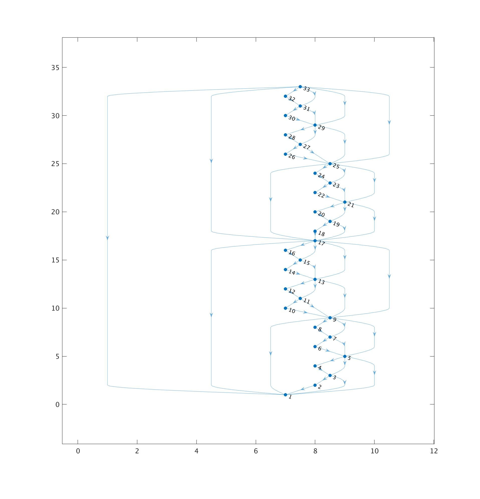

## Skip List in IPLD

This repo implements a skip list data-structure using IPLD.
IPLD skip list is append only data-structure providing `O(log(N))` lookups
and `O(1)` append.

This is achieved with a minimal size increase (1 additional link on average) in comparision with normal list/chain.


Graph of small skip list:



### Benchmark Results

With in-memory blockstore, `gets/op` signifies `Get` calls to the blockstore:
```
name                     time/op
Append/ex-size-1-8       2.31µs ± 5%
Append/ex-size-1000-8    2.56µs ± 3%
Append/ex-size-10000-8   2.67µs ± 3%
Append/ex-size-100000-8  2.90µs ± 2%
Get/size-1000-8          5.79µs ± 0%
Get/size-10000-8         11.2µs ± 2%
Get/size-100000-8        19.8µs ± 2%
Get/size-1000000-8       32.5µs ± 9%

name                     gets/op
Append/ex-size-1-8         0.00     
Append/ex-size-1000-8      0.08 ± 0%
Append/ex-size-10000-8     0.04 ± 0%
Append/ex-size-100000-8    0.06 ± 0%
Get/size-1000-8            1.79 ± 0%
Get/size-10000-8           3.42 ± 0%
Get/size-100000-8          5.07 ± 0%
Get/size-1000000-8         6.83 ± 0%
```

#### Licence

MIT + Apache 2.0
